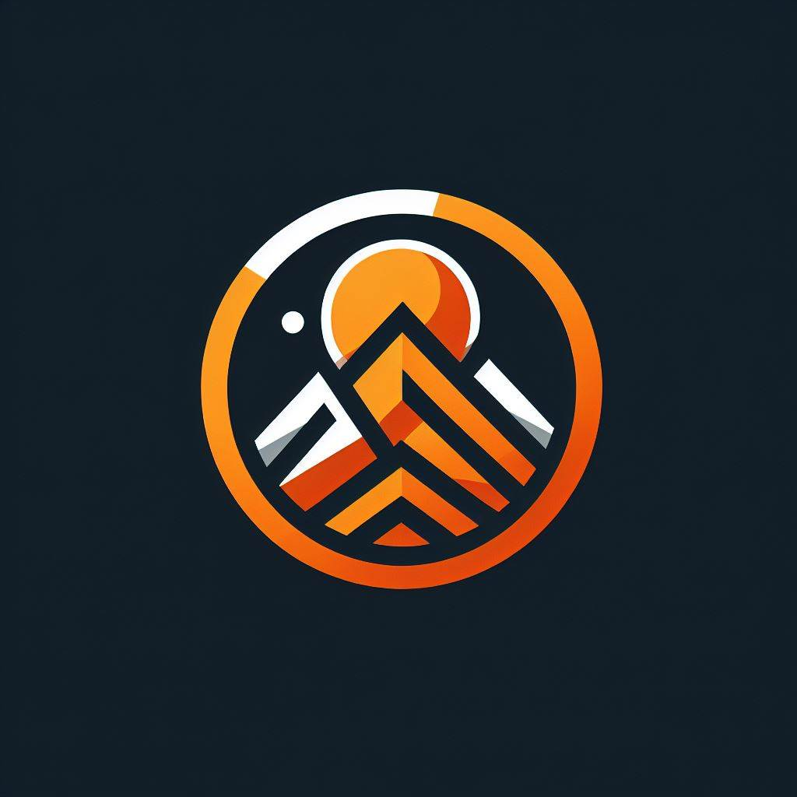
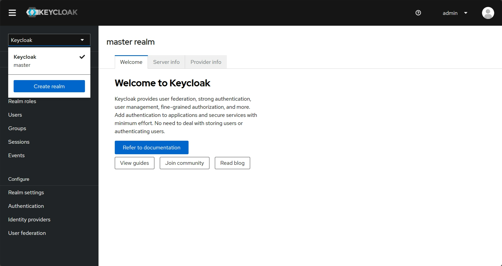
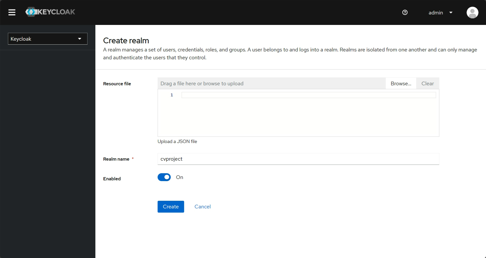
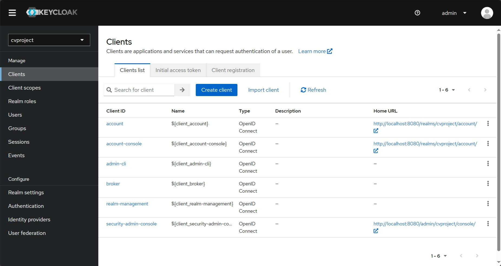
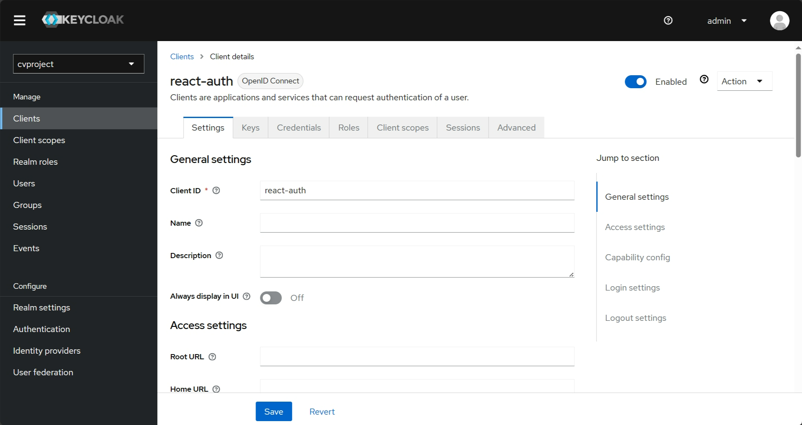
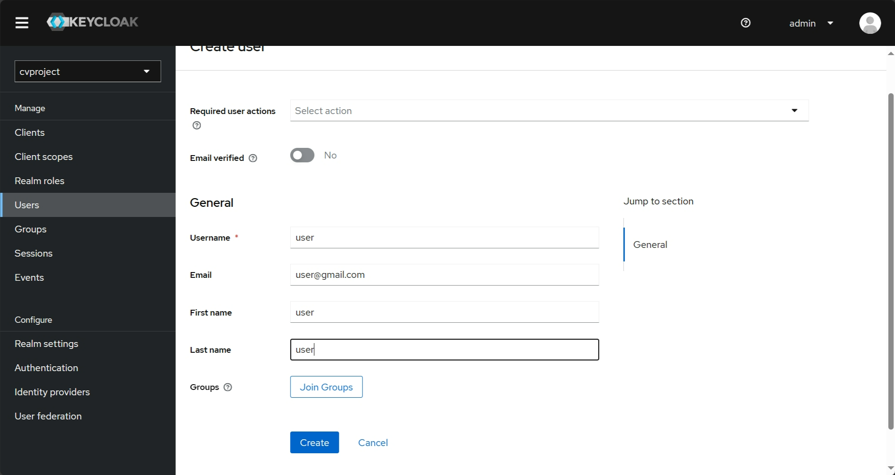
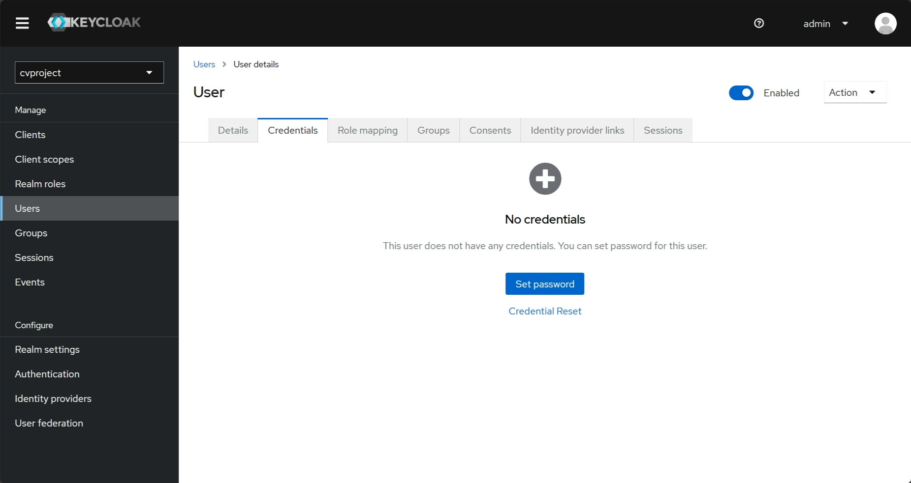
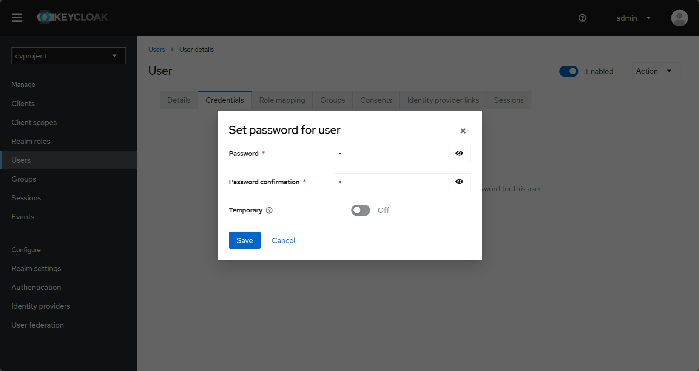

<a id="readme-top"></a>

[![Contributors][contributors-shield]][contributors-url]
[![Commits][commits-shield]][commits-url]
[![Forks][forks-shield]][forks-url]
[![Stargazers][stars-shield]][stars-url]
[![Issues][issues-shield]][issues-url]
[![MIT License][license-shield]][license-url]

<!-- PROJECT LOGO -->
<br />
<div align="center">
  <a href="https://github.com/dokkazy/cvproject">
    
  </a>

  <h3 align="center">CVProject</h3>

  <p align="center">
    <br />
    <a href="https://drive.google.com/drive/folders/1DvQY86IaHBM5-khyLAmYKA1RjR_unyr4?usp=sharing"><strong>Explore the docs »</strong></a>
    <br />
    <br />
    <a href="">View Demo</a>
    ·
    <a href="https://github.com/wnosphan/CV_Projec/issues">Report Bug</a>
    ·
    <a href="https://github.com/wnosphan/CV_Projec/issues">Request Feature</a>
  </p>
</div>


<!-- TABLE OF CONTENTS -->
<!-- 
<details>
  <summary>Table of Contents</summary>
  <ol>
    <li>
      <a href="#about-the-project">About The Project</a>
      <ul>
        <li><a href="#built-with">Built With</a></li>
      </ul>
    </li>
    <li>
      <a href="#start-environment">Start Environment</a>
    </li>
    <li><a href="#testing-cvproject-server-endpoints">Testing cvproject-server endpoints</a></li>
    <li><a href="#shutdown">Shutdown</a></li>
    <li><a href="#how-to-upgrade-cvproject-ui-dependencies-to-latest-version">How to upgrade cvproject-ui dependencies to latest version</a></li>
    <li><a href="#contributing">Contributing</a></li>
    <li><a href="#contributor">Contributor</a></li>
  </ol>
</details>
-->


<!-- ABOUT THE PROJECT -->


## About The Project

<!--[![Product Name Screen Shot][product-screenshot]](https://example.com)-->

The goal of this project is to secure `cvproject` using Keycloak. `cvproject` consists of two applications: one is a Spring Boot Rest API called `CVProject_Server` and another is a React application called `cvproject-ui`.

<p align="right">(<a href="#readme-top">back to top</a>)</p>


## Built With
<!--
- [`Java 17+`](https://www.oracle.com/java/technologies/downloads/#java17)
- [`npm`](https://docs.npmjs.com/downloading-and-installing-node-js-and-npm)
- [`Docker`](https://www.docker.com/)
- [`Keycloak`](https://www.keycloak.org/)
-->

* [![React][React.js]][React-url]
* [![Java][java.com]][java-url]
* [![Docker][docker.com]][docker-url]
* [![Keycloak][keycloak.org]][keycloak-url]
* [![Npm][npm.com]][npm-url]

<p align="right">(<a href="#readme-top">back to top</a>)</p>


<!-- GETTING STARTED -->
## Start Project
### Run with docker
- Open `docker-compose` file in `CV_Project/CVProject_Server` and change the project path
  ```
  ...
   nodejs:
    build: D:\FORK\CV_Project\cvproject-ui
  ...
   mail:
    build: D:\FORK\CV_Project\Mail
  ```
- Open terminal and navigate to `CV_Project/CVProject_Server` folder and run the command below
- Make sure that you have downloaded docker
  ```
  docker compose up
  ```
- After running successfully, access to `localhost:8080` to config keycloak
  <br/>
  <div>
     
     
  </div>
  
   
 - Click `import client` and import the `react-auth.json` in `keycloak-setting`
   <br/>
   <br/>
   <div>
     
     
   </div>
   <div>
     
     
   </div>
   

- Access `localhost:3001` and login to web app, using excel file in `import-file` to add new data

  <p align="right">(<a href="#readme-top">back to top</a>)</p>
  

## Applications URLs

| Application       | URL                                   | Credentials                           |
|-------------------|---------------------------------------|---------------------------------------|
| cproject-server   | http://localhost:8088                 |                                       |
| cvproject-ui      | http://localhost:3001                 |                                       |
| Keycloak          | http://localhost:8080/admin           |                                       |


<p align="right">(<a href="#readme-top">back to top</a>)</p>


## Shutdown

- To stop `CV_Project`, go to the terminals where they are running and press `Ctrl+C`

- To stop and remove docker compose containers, network and volumes, go to a terminal and, inside `CV_Project` root folder, run the command below
  ```
    docker compose down -v
  ```
<p align="right">(<a href="#readme-top">back to top</a>)</p>

## How to upgrade cvproject-ui dependencies to latest version

- In a terminal, make sure you are in `CV_Project/cvproject-ui` folder

- Run the following commands
  ```
    npm upgrade
    npm i -g npm-check-updates
    ncu -u
    npm install
  ```
<p align="right">(<a href="#readme-top">back to top</a>)</p>

<!-- CONTRIBUTING -->
<!--
## Contributing

Contributions are what make the open source community such an amazing place to learn, inspire, and create. Any contributions you make are **greatly appreciated**.

If you have a suggestion that would make this better, please fork the repo and create a pull request. You can also simply open an issue with the tag "enhancement".
Don't forget to give the project a star! Thanks again!

1. Fork the Project
2. Create your Feature Branch (`git checkout -b feature/AmazingFeature`)
3. Commit your Changes (`git commit -m 'Add some AmazingFeature'`)
4. Push to the Branch (`git push origin feature/AmazingFeature`)
5. Open a Pull Request

<p align="right">(<a href="#readme-top">back to top</a>)</p>
-->
## Contributor

<table>
  <tr align="center">
    <td align="center"><a href="https://github.com/KuaDtrai"><br /><sub><b>Ho Thanh Kien</b></sub></a><br />💻</a></td>
    <td align="center"><a href="https://github.com/wnosphan"><br /><sub><b>wnosphan</b></sub></a><br />💻</a></td>
    <td align="center"><a href="https://github.com/dokkazy"><br /><sub><b>Võ Công Huy</b></sub></a><br />💻</a></td>
    </td>
    <td align="center"><a href="https://github.com/lock1723"><br /><sub><b>lock1723</b></sub></a><br />💻</a></td>
   
  </tr>
</table>

<p align="right">(<a href="#readme-top">back to top</a>)</p>


<!-- MARKDOWN LINKS & IMAGES -->
<!-- https://www.markdownguide.org/basic-syntax/#reference-style-links -->
[contributors-shield]: https://img.shields.io/github/contributors/wnosphan/CV_Project.svg?style=for-the-badge
[contributors-url]: https://github.com/wnosphan/CV_Project/graphs/contributors
[commits-shield]: https://img.shields.io/github/commit-activity/w/dokkazy/cvproject?style=for-the-badge&labelColor=000000
[commits-url]: https://github.com/dokkazy/cvproject/graphs/commit-activity
[forks-shield]: https://img.shields.io/github/forks/dokkazy/cvproject.svg?style=for-the-badge
[forks-url]: https://github.com/dokkazy/cvproject/network/members
[stars-shield]: https://img.shields.io/github/stars/dokkazy/cvproject.svg?style=for-the-badge
[stars-url]: https://github.com/dokkazy/cvproject/stargazers
[issues-shield]: https://img.shields.io/github/issues/dokkazy/cvproject.svg?style=for-the-badge
[issues-url]: https://github.com/dokkazy/cvproject/issues
[license-shield]: https://img.shields.io/github/license/dokkazy/cvproject.svg?style=for-the-badge
[license-url]: https://github.com/dokkazy/cvproject/blob/master/LICENSE.txt
[product-screenshot]: images/OIG3.png
[React.js]: https://img.shields.io/badge/React-18-20232A?style=for-the-badge&logo=react&logoColor=61DAFB
[React-url]: https://react.dev/
[java.com]: https://img.shields.io/badge/Java-17-ED8B00?style=for-the-badge&logo=openjdk&logoColor=white
[java-url]: https://www.oracle.com/java/technologies/downloads/#java17
[docker.com]: https://img.shields.io/badge/Docker-d4dbd3?style=for-the-badge&logo=docker&logoColor=blue
[docker-url]: https://www.docker.com/
[keycloak.org]: https://img.shields.io/badge/Keycloak-24.0.1-ff2f00?style=for-the-badge
[keycloak-url]: https://www.keycloak.org/
[npm.com]: https://img.shields.io/badge/npm-ccc?style=for-the-badge&logo=npm&logoColor=#fff
[npm-url]: https://www.npmjs.com

